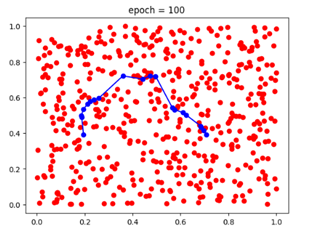
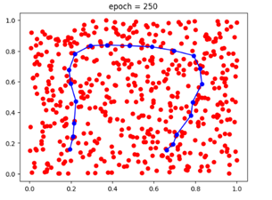

# Kohonen (SOM) Algorithm Project 2023

🤖 **Implementing Kohonen (SOM) Algorithm for Neural Network Training**

## Table of Contents

- [Introduction](#introduction)
- [Project Description](#project-description)
- [Results](#results)
- [Usage](#usage)
- [License](#license)

## Introduction

This repository contains our solution for the Kohonen (SOM) Algorithm Project 2023, as part of Prof. Manevitz's class. The project focuses on implementing the Kohonen algorithm and experimenting with different data distributions to observe its behavior.

I added the [assignment](Ex2-2023-Kohonen.pdf) instructions, [code solution](Kohonen.ipynb) and the assignment [Inline questions solution](Ex2-Solution.pdf) as well. 📚

## Project Description

### Part A - Line and Non-Uniform Distributions

1. **Line Distribution**
   - Implemented Kohonen algorithm with 20 neurons to fit a line to a square.
   - Experimented with 200 neurons to observe changes.
   - Visualized the evolution of the Kohonen map over iterations.
   - Results:
     | Epoch | 20 Neurons | 200 Neurons | 
     | :-----: | :-----: | :-----: |
     | 0 |  | |
     | 1 |  | |
     | 2 |  | |

2. **Non-Uniform Distributions**
   - Explored two non-uniform data distributions within a square.
   - Fit topologically shaped lines of neurons to these distributions.
   - Presented snapshots of the evolving Kohonen maps.
   - Results:
     | Epoch | First Distribution  | Second Distribution  | 
     | :-----:| :-----: | :-----: |
     | 0 |  | |
     | 1 |  | |
     | 2 |  | |

### Part A.2 - Donut Distribution

1. **Donut Distribution**
   - Created a circle of 300 neurons to fit a donut-shaped data distribution.
   - Visualized the evolution of the Kohonen map for this scenario.
   - Results:
     | Epoch 0  | Epoch 100 | Epoch 250 |
     | :-----: | :-----: | :-----: |
     |  |  |  | 

### Part B - Monkey Hand Experiment

1. **Hand Distribution**
   - Used an image of a hand and processed it to create a dataset.
   - Implemented Kohonen algorithm with 400 neurons arranged in a 20x20 mesh.
   - Showed the mesh superimposed on the hand and its evolution.
   - Results:
     | Epoch 0 | Epoch 100 | Epoch 250 |
     | :-----: | :-----: | :-----: |
     |  |  |  |

2. **Hand with Finger Removed**
   - Adapted the Kohonen network to work with a "hand with 3 fingers."
   - Presented snapshots of the rearranged mesh.
   - Results:
     | Epoch 0 | Epoch 100 | Epoch 250 |
     | :-----: | :-----: | :-----: |
     |  |  |  |

## Usage

- To run the code, refer to the provided `Kohonen.ipynb` notebook in the Google Drive folder.

## License

Licensed under the Apache License, Version 2.0 (the "License"); you may not use this file except in compliance with the License. You may obtain a copy of the License at http://www.apache.org/licenses/LICENSE-2.0 Unless required by applicable law or agreed to in writing, software distributed under the License is distributed on an "AS IS" BASIS, WITHOUT WARRANTIES OR CONDITIONS OF ANY KIND, either express or implied. See the License for the specific language governing permissions and limitations under the License.

## Contact Us

📣 We encourage you to get involved! If you have any questions, suggestions, or run into any issues with this project, please don't hesitate to open an issue on this repository. 

👉 [Open an Issue](https://github.com/orelz890/Neuro_Ex2_Kohonen/issues)

We value your feedback and contributions, and we'll do our best to address any concerns or ideas you may have. Let's make this project better together!

🚀 **Happy Coding!**
